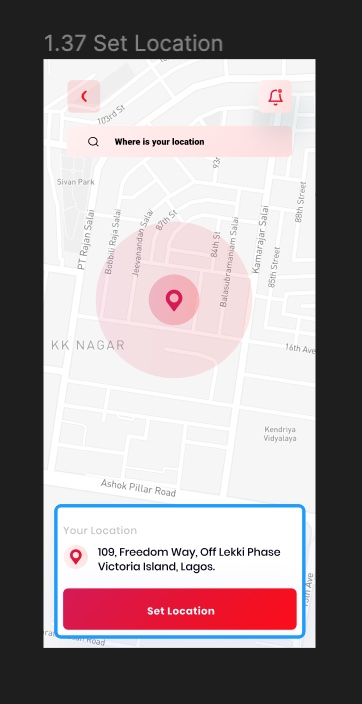

# Getir Android Kotlin Bootcamp w2 Assignment

###  If you want to check the video, [click here](public/demo.mp4)

---

## Ekran Görüntüleri

### Yapılacaklar

1 - Set Location sayfasının tasarımının kodlanması

2- Sayfa açıldığında haritada mevcut konuma yönlendirilmesi
